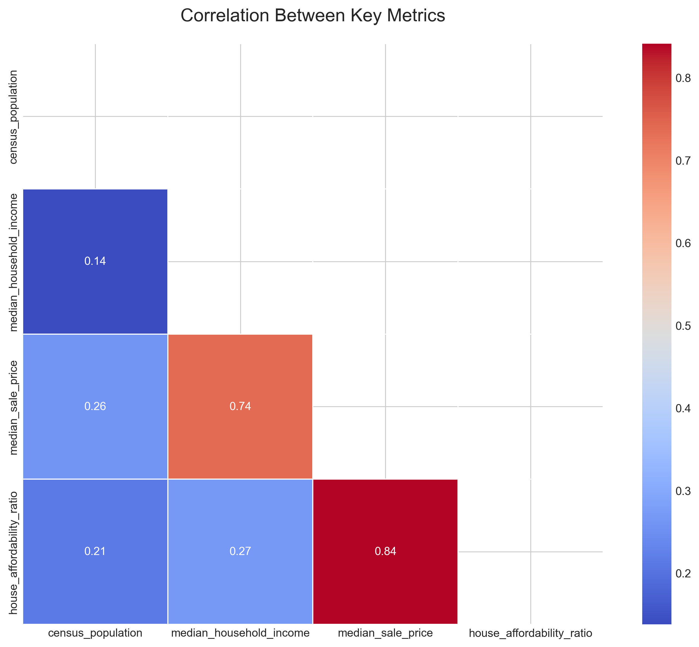

# State Housing Affordability Analysis

## Project Overview
This project takes Census Bureau and Redfin data to analyze housing affordability across U.S. states. It demonstrates automated data processing using Python.

## Assignment Requirements
The task was to:
1. Create a Python script that processes multiple CSV input files
2. Perform data transformations following specific formulas
3. Generate a CSV output matching the given output file
4. Create additional visualizations and analysis (optional)

## Repository Structure
* **scripts/** - Python scripts for data processing and visualization
   * `data_processing.py` - Main script that processes CSV data and generates the output file
   * `data_visualization.py` - Script that creates visualizations and additional analysis
* **data/** - Input data files
* **output/** - Generated output CSV file
* **visualizations/** - Visualizations generated from the data

## Key Features
* Automated data extraction from Census and Redfin datasets
* Population ranking and analysis
* Median household income comparison
* Housing price analysis
* Housing affordability ratio calculations
* Data visualizations including:
   * Correlation analysis
   * Top 10 states by various metrics
   * Affordability comparisons
   * Statistical distributions

## Visualizations

1. Clone this repository
2. Ensure you have Python and required libraries installed:

pip install pandas numpy matplotlib seaborn scipy

3. Run the data processing script:
   
python scripts/data_processing.py

4. Run the visualization script:
   
python scripts/data_visualization.py

## Key Findings
From the executive summary:
* Housing affordability varies significantly across states
* There is a strong correlation between median income and housing prices
* The least affordable states tend to be Hawaii, California, and Massachusetts
* The most affordable states tend to be West Virginia, Mississippi, and Oklahoma

## Technologies Used
* Python
* Pandas for data processing
* Matplotlib and Seaborn for visualizations
* NumPy for numerical operations
* SciPy for statistical analysis
